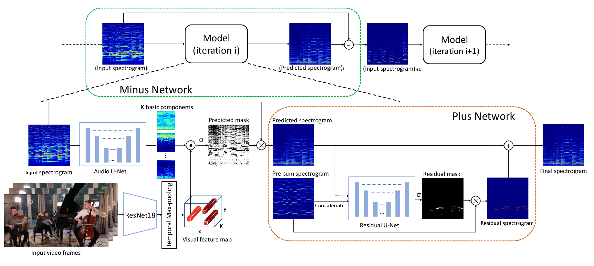

# Recursive Visual Sound Separation Using Minus-Plus Net 

[Xudong Xu](https://sheldontsui.github.io/),[Bo Dai](https:daibo.info), [Dahua Lin](http://dahua.me)

We propose a recursive **Minus-Plus Network(MP-Net)** for visual sound separation task. MP-Net separates sounds recursively in the order of average energy, removing the separated sound from the mixture at the end of each prediction, until the mixture becomes empty or contains only noise. 

[[Project]](https://SheldonTsui.github.io/projects/MP-Net) [[Paper]](https://arxiv.org/abs/1908.11602) [[Demo]](https://www.youtube.com/watch?v=io_myrxtA4I)



## Requirements
* Python 3.6 is used. Basic requirements are listed in the 'requirements.txt'
```
pip install -r requirements.txt 
```

## Dataset

**MUSIC** can be accessed [here](https://github.com/roudimit/MUSIC_dataset). Note that, Zhao. et al further proposed a new and larger dataset [**MUSIC21**](https://arxiv.org/abs/1904.05979) in ICCV 2019.

**VEGAS** is a 10-category subset of the large-scale dataset [**AudioSet**](https://research.google.com/audioset/). **VEGAS** was cleaned by Zhou et al in CVPR 2018 paper [Visual2Sound](https://www.cs.unc.edu/~yipin/pub/cvpr2018.pdf) and can be fetched [here](http://bvision11.cs.unc.edu/bigpen/yipin/visual2sound_webpage/visual2sound.html). 

## Training and Testing

All the training and testing bash scripts can be found in *'./scripts'*. For the data preparing, we follow the same procedure as [PixelPlayer](https://github.com/hangzhaomit/Sound-of-Pixels). 

## License and Citation
The usage of this software is under [CC-BY-4.0](https://github.com/SheldonTsui/Minus-Plus-Network/blob/master/LICENSE).
```
@inproceedings{xu2019recursive,
  title={Recursive visual sound separation using minus-plus net},
  author={Xu, Xudong and Dai, Bo and Lin, Dahua},
  booktitle={Proceedings of the IEEE International Conference on Computer Vision},
  pages={882--891},
  year={2019}
}
```

## Acknowledgement
The structure of this codebase is largely borrowed from [PixelPlayer](https://github.com/hangzhaomit/Sound-of-Pixels).  
